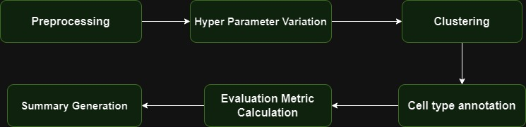
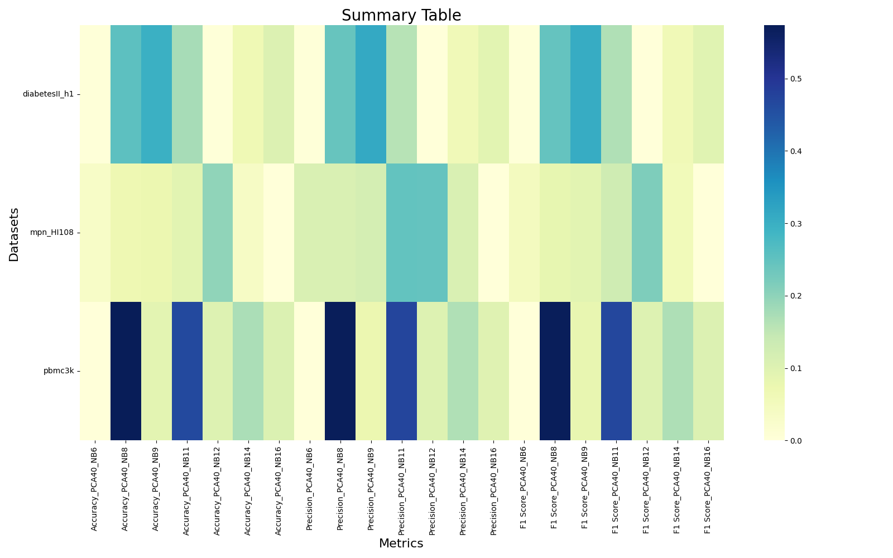
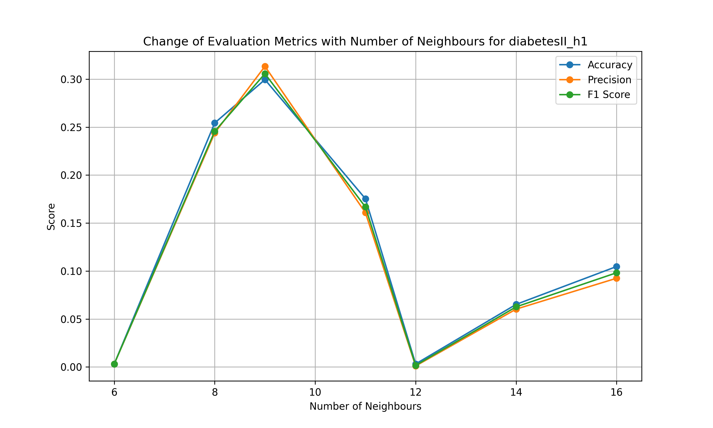
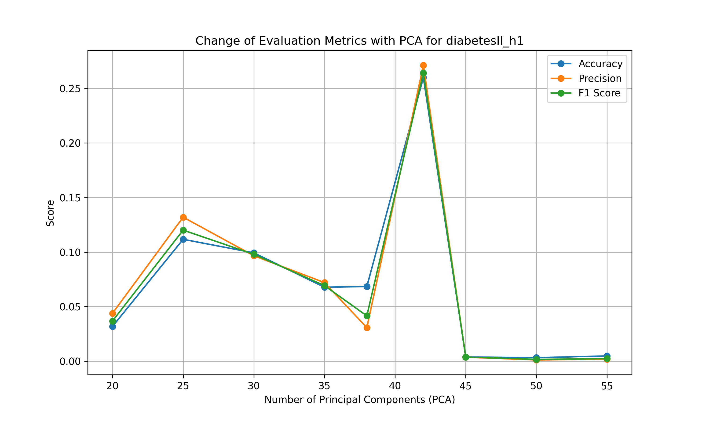
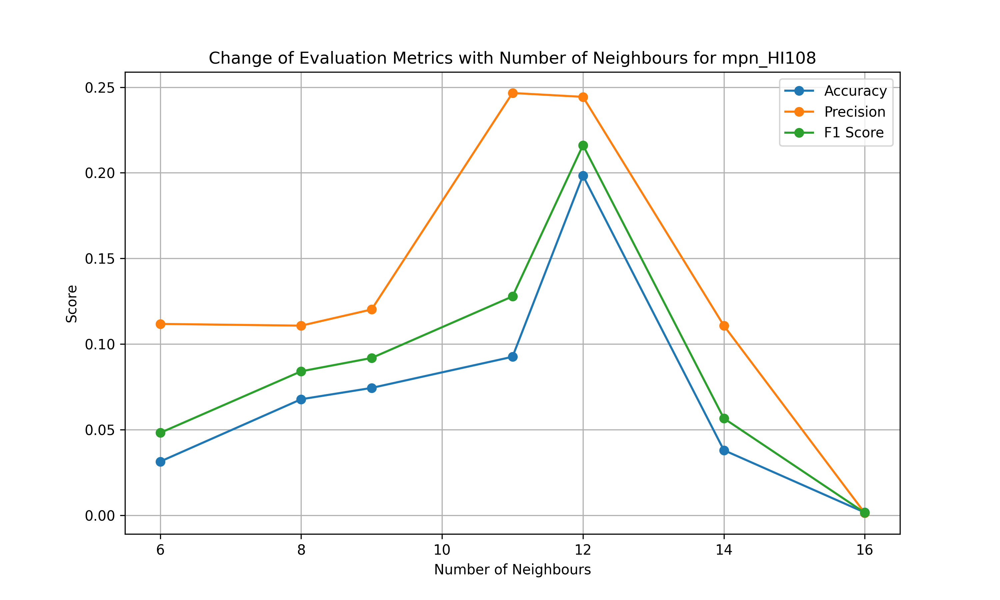
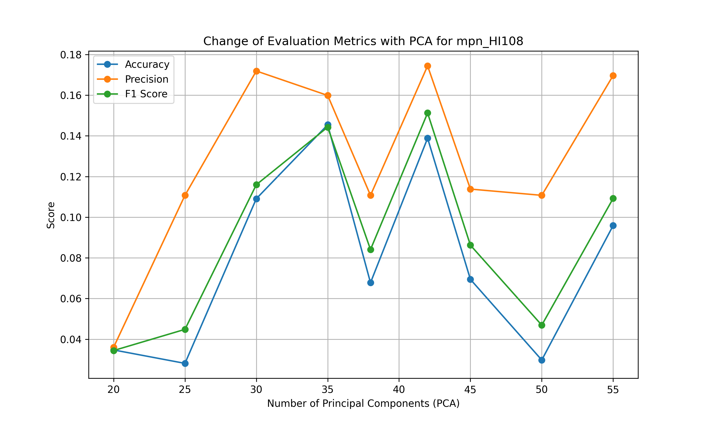
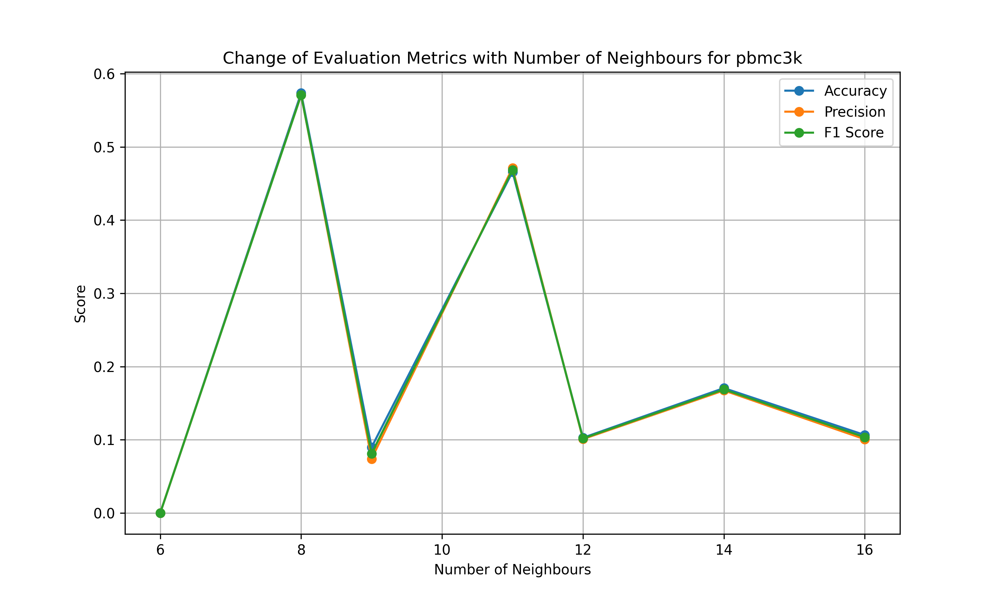
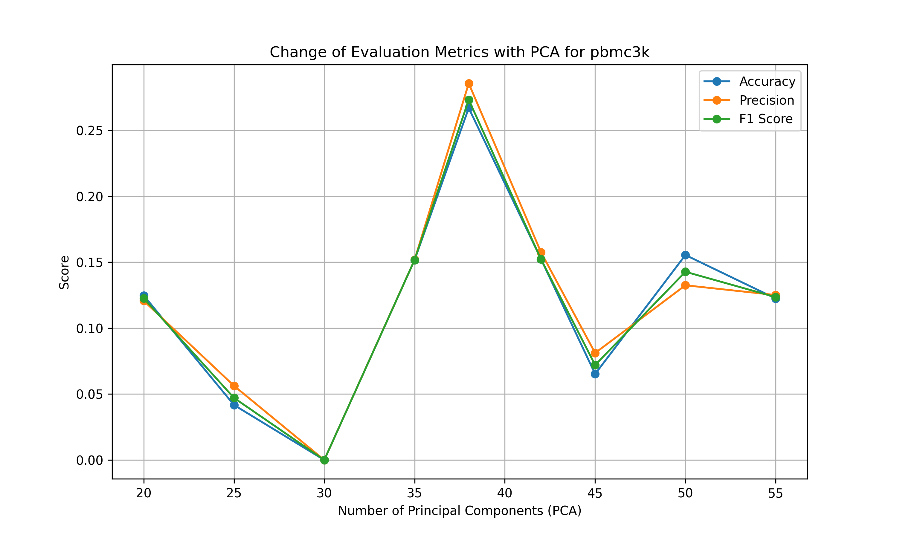

> **Disclaimer:** All essential materials, such as data, documents, pipelines, etc., associated with the BioNets Project, are the intellectual property of the Biomedical Network Science ([BIONETS](https://www.bionets.tf.fau.de/)) lab at [FAU Erlangen-Nürnberg](https://www.fau.eu/). Kindly acknowledge that any duplication of content from this source makes you liable.


Welcome to the Biomedical Network Science (BioNets) Project repository for the Winter'23/24 semester at [Friedrich-Alexander University Erlangen-Nürnberg](https://www.fau.eu/). This repository contains necessary files and documents for the BioNets project called **"Exploring the impact of hyper-parameter variation in Single Cell Analysis"**, proposed by Biomedical Network Science ([BIONETS](https://www.bionets.tf.fau.de/)) lab, supervised by [Prof. Dr. David B. Blumenthal](https://www.bionets.tf.fau.de/person/david-b-blumenthal/), and [Dr. Anne Hartebrodt](https://www.bionets.tf.fau.de/person/anne-hartebrodt/) at FAU Erlangen-Nürnberg.

## Project Contributors
- [Ismam Hussain Khan](https://www.linkedin.com/in/ismam-hussain-khan-4762651a6/), Graduate Student in Artificial Intelligence at FAU Erlangen-Nürnberg

## Project Goals

The core goals of the project are as follows:

- Build and run Automated pipelines for
    - Downloading and Preprocessing the data
    - Creating multiple clusters based on different set of parameters 
    - Doing cell type annotation for each of them
    - Computing and visualizing evaluation metrics for each set of parameters to analyze the impact of parameter change
- Tuning this pipeline to work for multiple datasets for result comparison. 
- Making a Summary report to compare all the results from different datasets. 

## Project Structure

```bash
fau-bionets-project-ws23
├── dataset/                          # Data directory
│   ├── dataset_1/                    # dataset name example: mpn_hI108                        
│   │   │                
│   │   │── barcodes.tsv.gz
│   │   ├── features.tsv.gz
│   │   │── matrix.mtx.gz
│   │   
│   │── dataset_2/                     # dataset name example: disbetesII_h1                          
│   │   │                
│   │   │── barcodes.tsv.gz
│   │   ├── features.tsv.gz
│   │   │── matrix.mtx.gz
│   │    
│   │── dataset_3/                    #  dataset name example: pbmc3k                         
│   │   │                
│   │   │── barcodes.tsv.gz
│   │   ├── features.tsv.gz
│   │   │── matrix.mtx.gz
│   │  
│   
│   
├── Images/                           # Contains all the Images genrated during analysis 
│   
├── result/                            # Results directory
│   ├── dataset_1_evalujation_results.pkl # file to store evaluation result of dataset 1
│   ├── dataset_2_evalujation_results.pkl # file to store evaluation result of dataset 2
│   │── dataset_3_evalujation_results.pkl # file to store evaluation result of dataset 1
│   │── summary_table.png               # summary table to compare the result of all the datasets
│   
├── docs/                               # Documents directory for snapshots, videos, etc
│   ├── assets/                         # Contains readme assets
│   ├── presentation/                   # Contains presentation files
│   └── report/                         # Contains report files
│   
│   
├── readme.md                           # read.me file containing all the necessary info about the project   
├── pipeline.py                         # Main Code logic to do all the analysis
├── generate_summary.py                 # Code to generate summary table with all the dataset
├── requirements.txt                    # list of required modules to install and run
├── run_scsa.sh                         # code to run the annotation process
├── run_single.sh                       # Code to run analysis for a single dataset of choice
├── run.sh                              # file to run the entire pipeline and generate summary

```

## Project Details

### 1. Dataset
In total there are 3 diffferent datasets from 2 different resources. Two data sources of two diseases, such as type II Diabetes Mellitus and Myeloproliferative Neoplasm (MPN) have been obtained from the [Gene Expression Omnibus](https://www.ncbi.nlm.nih.gov/geo/) repository.Another dataset consist of 3k Peripheral Blood Mononuclear Cells (PBMCs) from a Healthy Donor and are freely available from [10x Genomics](https://www.10xgenomics.com/). here is the download [LINK](https://support.10xgenomics.com/single-cell-gene-expression/datasets/1.1.0/pbmc3k). From the link download the 'GENE/cell matrix filtered'. Details of the dataset are given below,

- **Peripheral Blood Mononuclear Cells (PBMCs):**  The dataset comprises 3,000 peripheral blood mononuclear cells (PBMCs) from a healthy donor, sequenced using Cell Ranger 1.1.0. Each cell contains approximately 1pg RNA. A total of 2,700 cells were successfully detected, sequenced on Illumina NextSeq 500 with an average of 69,000 reads per cell. The sequencing setup includes a 98bp transcript read, 8bp I5 sample barcode, 14bp I7 GemCode barcode, and 10bp UMI read. The analysis was conducted with a focus on 3,000 cells. [source_url](https://support.10xgenomics.com/single-cell-gene-expression/datasets/1.1.0/pbmc3k).

- **Diabetes Mellitus Type II:** This dataset examines the systemic immunological changes induced by type 2 diabetes mellitus (DM) in individuals diagnosed with periodontitis (PD). Utilizing single-cell RNA sequencing (scRNA-seq) analysis of peripheral blood mononuclear cells (PBMCs), the study aims to contrast the immune response in patients with PD alone versus those with both PD and DM (PDDM). By comparing these groups, researchers aim to deepen the understanding of the intricate immunological interplay between PD and DM. The sample distribution consists of 11 healthy control subjects, 10 PD patients without DM, and 6 patients diagnosed with PDDM. [[source-url](https://www.ncbi.nlm.nih.gov/geo/query/acc.cgi?acc=GSE244515)]

- **Myeloproliferative Neoplasm (MPN):**  This dataset presents an in-depth examination of platelets obtained from patients diagnosed with myeloproliferative neoplasms (MPNs), with a specific focus on essential thrombocythemia (ET). Carried out by researchers, the study unveiled noteworthy metabolic changes influencing abnormal platelet function and inflammation in MPNs, employing single-cell RNA sequencing (scRNA-Seq) analysis of primary PBMC samples. Particularly, transcripts associated with platelet activation, mTOR, and oxidative phosphorylation (OXPHOS) were observed to be heightened in ET platelets. [[source-url](https://www.ncbi.nlm.nih.gov/geo/query/acc.cgi?acc=GSE244589)].

### 2. Pipeline Description
Our pipeline mainly does 4 things
The Key task achieved by our pipeline can be divided into three key parts: For each set of hyper parameters( in our case the hyper parameters are 1. Number of Principal Components 2. Number of Neighbours) 
(i) Preprocessing and clustering the data
(ii) Automatic cell-type annotation
(iii) Computing and visualizing evaluation metrics. The main script is written in [[script-url](pipeline.py)] which has the logic to apply these 3 parts for all the dataset.
(iv) Generating the summary table of all these datasets. this is done with [[script-url](generate_summary.py)]

To run the entire pipeline for all the dataset at once and to generate the summary table automatically, just run the script named [[script-url](run.sh)]. If you want to chek the pipeline for a single dataset, run the script named [[script-url](run_single.sh)].
Please refer to the environment setup section for detailed instructions on running the pipelines.
here is an image descriing te pipeline process.



#### 2.1. Preprocessing and clustering data
The preprocessing pipeline begins by applying quality control measures to exclude low-quality observations, considering thresholds for mitochondrial gene expression, UMIs, and detected genes. Subsequently, the data undergoes normalization via logarithmic transformation and Pearson correlation, followed by the selection of highly variable genes and principal component analysis (PCA) for dimensionality reduction. Lastly, a neighborhood graph is constructed for visualization purposes, and clustering techniques like Leiden are employed to identify cell populations.
The following image shows the effect of Hyper Parameter changing in cell type clustering
 
this image shows the clustering for a single set of Hyperparameters using leiden
 

#### 2.2. Automatic Cell-type Annotation
In this stage, automatic cell type annotation has been performed using the SCSA method.

- **SCSA:** SCSA is an automated tool designed to annotate cell types in scRNA-seq data. It utilizes a scoring annotation model that integrates differentially expressed genes (DEGs) and confidence levels of cell markers from both established and user-defined sources. This approach removes the necessity for manual methods, offering consistent and accurate cell type annotations. Assessment using real scRNA-seq datasets confirms SCSA's capability to accurately assign cells to their respective types with high precision. [[original-paper](https://www.frontiersin.org/journals/genetics/articles/10.3389/fgene.2020.00490/full)]. This is how it looks like after cell type annotation
 

#### 2.3. Computing and visualizing evaluation metrics
After cell type annotation, evaluation metrics like f1 score, precision and accuracy is measured for each set of parameters. To calculate the metrics, we take annotation result of the standard scanpy hyperparameters to be the goldern standard and compare the result of other parameters based on that. We plot separately the effect of changing PCA and changing Number of neighbours on the evaluation metrics
the following image shows the impact of changing PCA on the evaluatuion metric

 

the following image shows the impact of changing Number of Neighbours on the evaluatuion metric


#### 2.4 Generating Summary Table
After finding out all the accuracies, precision, f1 score for each set of parameters for every dataset, we store the results in  .pkl file and generate the summary report for comparison. This is stored in the result folder. The following is an example summary table


### 3. Results
In this section the result of my project will be presented. To find the presentation of the project go [here](docs/presentation/Presentation.pptx). and to find the report go [here](docs/report/report.pdf). Keep in mind that the presentation doesn't have all the latest updates of the work but the report does. 

#### 3.1. Evaluation Metric Visualization
Here we will show the change of evalluation metric such as f1 score, accuracy and precision for each dataset when varying the hyperparameters such as PCA value and number of neighbour
**Diabetes Dataset** The figures below shows the effect of varying neighbours on evaluation metric



The figures below shows the effect of varying PCA value on evaluation metric


**MPN Dataset:** The figures below shows the effect of varying neighbours on evaluation metric



The figures below shows the effect of varying PCA value on evaluation metric


**pbmc3k Dataset:** The figures below shows the effect of varying neighbours on evaluation metric



The figures below shows the effect of varying PCA value on evaluation metric



**Summary Heatmap Visualization:** The figure below demonstrates the distribution of cell types according to all annotation methods for Type 2 Diabetes (a) and Myeloproliferative Neoplasm (MPN) diseases (b).
**Summary Table Varying Number of Neighbours:** 
below is the summary table for all the datasets to show change of evaluation metrics by varying number of neighbours 


**Summary Table Varying PCA Value:** 
below is the summary table for all the datasets to show change of evaluation metrics by varying PCA value


## 4. Environment Setup
This section provides step-by-step instructions for setting up the required environment on Linux Operating System

### Used Technologies:
1. [Python3.x](https://www.python.org)
2. [Scanpy](https://scanpy.readthedocs.io/en/stable/) - it is a Python package and a scalable toolkit for analyzing single-cell gene expression data built jointly with [anndata](https://anndata.readthedocs.io/en/latest/).
3. [SCSA](https://github.com/bioinfo-ibms-pumc/SCSA)

### Linux

```bash
# Create a virtual environment and activate
python3 -m venv <environment_name>
source <environment_name>/bin/activate
# Upgrade pip
pip install --upgrade pip
# Install required Python packages
pip install -r requirements.txt
# Deactivate and remove virtual environment if needed
deactivate
rm -rf <environment_name>

### Run the Project

```bash
# Clone the repository
git clone git@github.com:ishmam367/Single-Cell-Analysis.git
cd Code

# Create and activate virtual environment
source <environment_name>/bin/activate

# Run the entire pipeline on all dataset with summary report
sh run.sh

#Run pipeline for a single dataset of your choosing (select one value from the given option as dataset id)
sh run_single.sh

```

## 5. Conclusion

In conclusion, this project represents a significant effort toward automating key stages of single-cell RNA sequencing (scRNA-seq) data analysis. By developing robust pipelines for data preprocessing, clustering, cell type annotation, evaluation metric computation and summary generation from all the dataset. we aim to streamline the analytical process, enabling researchers to obtain valuable insights more efficiently.It helps them have a clear idea about the impact of parameter change in different datasets and within the same dataset. Through the implementation of these automated workflows, we anticipate facilitating broader accessibility to scRNA-seq analysis tools and fostering a deeper understanding of cellular dynamics.