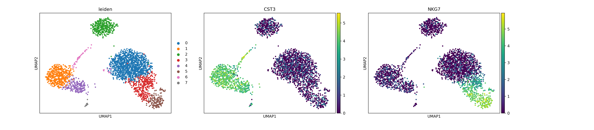

> _**Disclaimer:** All essential materials, such as data, documents, pipelines, etc., associated with the BioNets Project, are the intellectual property of the Biomedical Network Science ([BIONETS](https://www.bionets.tf.fau.de/)) lab at [FAU Erlangen-Nürnberg](https://www.fau.eu/). Kindly acknowledge that any duplication of content from this source makes you liable.


Welcome to the Biomedical Network Science (BioNets) Project repository for the Winter'23/24 semester at [Friedrich-Alexander University Erlangen-Nürnberg](https://www.fau.eu/). This repository contains necessary files and documents for the BioNets project called **"Exploring the impact of hyper-parameter variation in Single Cell Analysis"**, proposed by Biomedical Network Science ([BIONETS](https://www.bionets.tf.fau.de/)) lab, supervised by [Prof. Dr. David B. Blumenthal](https://www.bionets.tf.fau.de/person/david-b-blumenthal/), and [Dr. Anne Hartebrodt](https://www.bionets.tf.fau.de/person/anne-hartebrodt/) at FAU Erlangen-Nürnberg.

## Project Contributors
- [Ismam Hussain Khan](https://www.linkedin.com/in/ismam-hussain-khan-4762651a6/), Graduate Student in Artificial Intelligence at FAU Erlangen-Nürnberg

## Project Goals

The core goals of the project are as follows:

- Build and run Automated pipelines for
    - Downloading and Preprocessing the data
    - Creating multiple clusters based on different set of parameters 
    - Doing cell type annotation for each of them
    - Computing and visualizing evaluation metrics for each set of parameters to analyze the impact of parameter change
- Tuning this pipeline to work for multiple datasets for result comparison. 

## Project Structure

```bash
fau-bionets-project-ws23
├── dataset/                            # Data directory
│   ├── disease_id1/                    # Disease Name 1, e.g. Diabetes II                           
│   │   │                # Case samples
│   │   │   │   ├── barcodes.tsv.gz
│   │   │   │   ├── features.tsv.gz
│   │   │   │   └── matrix.mtx.gz
│   │   │   └── control/                # Control samples
│   │   │       ├── barcodes.tsv.gz
│   │   │       ├── features.tsv.gz
│   │   │       └── matrix.mtx.gz
│   │   ├── dataset_id2/
│   │   └── ...
│   ├── disease_id2/                    # Disease Name 2, e.g. MPN
│   └── ...
├── pipelines/                          # Main pipeline modules
│   ├── services/                       # Pipeline services
│   │   ├── adata_handler.py            # Script for data loading, saving, etc
│   │   ├── adata_preprocessor.py       # Script for preprocessing
│   │   ├── cell_type_annotation.py     # Script for automatic cell annotation
│   │   └── diff_gene_exp_analysis.py   # Script for DGE analysis
│   ├── summary_cell_anno.py            # Script for generating summary results
│   ├── run_pipelines.sh                # Script for running the whole pipeline
│   └── cleaner.sh                      # Script for cleaning temporary files (optional)
├── results/                            # Results directory
│   ├── summary/                        # Summary results directory
│   ├── disease_id1/                    # Results directory of Disease 1
│   │   ├── dataset_id1/                # Store results of dataset1
│   │   ├── dataset_id2/                # Store results of dataset2
│   │   └── ...
│   ├── disease_id2/                    # Results directory of Disease 2
│   └── ...
├── dashboard/                          # Streamlit Dashboard directory
│   ├── .streamlit/                     # Contains Streamlit config file
│   ├── pages/                          # Contains pages of Dashboard
│   │   ├── 1_Summary.py                # Summary page of Dashboard
│   │   ├── 2_Individual_Results.py     # Individual results page of Dashboard
│   │   └── 3_Comparison.py             # Comparison page of Dashboard
│   └── _Home.py                        # Home page of Dashboard
├── docs/                               # Documents directory for snapshots, videos, etc
│   ├── assets/                         # Contains readme assets
│   ├── presentation/                   # Contains presentation files
│   └── report/                         # Contains report files
└── README.md                           # Project documentation
```

## Project Details

### 1. Dataset
In total there are 3 diffferent datasets from 2 different resources. Two data sources of two diseases, such as type II Diabetes Mellitus and Myeloproliferative Neoplasm (MPN) have been obtained from the [Gene Expression Omnibus](https://www.ncbi.nlm.nih.gov/geo/) repository.Another dataset consist of 3k Peripheral Blood Mononuclear Cells (PBMCs) from a Healthy Donor and are freely available from [10x Genomics](https://www.10xgenomics.com/). here is the download [LINK](https://support.10xgenomics.com/single-cell-gene-expression/datasets/1.1.0/pbmc3k). From the link download the 'GENE/cell matrix filtered'. Details of the dataset are given below,

- **Peripheral Blood Mononuclear Cells (PBMCs):**  The dataset comprises 3,000 peripheral blood mononuclear cells (PBMCs) from a healthy donor, sequenced using Cell Ranger 1.1.0. Each cell contains approximately 1pg RNA. A total of 2,700 cells were successfully detected, sequenced on Illumina NextSeq 500 with an average of 69,000 reads per cell. The sequencing setup includes a 98bp transcript read, 8bp I5 sample barcode, 14bp I7 GemCode barcode, and 10bp UMI read. The analysis was conducted with a focus on 3,000 cells. [source_url](https://support.10xgenomics.com/single-cell-gene-expression/datasets/1.1.0/pbmc3k).

- **Diabetes Mellitus Type II:** This dataset examines the systemic immunological changes induced by type 2 diabetes mellitus (DM) in individuals diagnosed with periodontitis (PD). Utilizing single-cell RNA sequencing (scRNA-seq) analysis of peripheral blood mononuclear cells (PBMCs), the study aims to contrast the immune response in patients with PD alone versus those with both PD and DM (PDDM). By comparing these groups, researchers aim to deepen the understanding of the intricate immunological interplay between PD and DM. The sample distribution consists of 11 healthy control subjects, 10 PD patients without DM, and 6 patients diagnosed with PDDM. [[source-url](https://www.ncbi.nlm.nih.gov/geo/query/acc.cgi?acc=GSE244515)]

- **Myeloproliferative Neoplasm (MPN):**  This dataset presents an in-depth examination of platelets obtained from patients diagnosed with myeloproliferative neoplasms (MPNs), with a specific focus on essential thrombocythemia (ET). Carried out by researchers, the study unveiled noteworthy metabolic changes influencing abnormal platelet function and inflammation in MPNs, employing single-cell RNA sequencing (scRNA-Seq) analysis of primary PBMC samples. Particularly, transcripts associated with platelet activation, mTOR, and oxidative phosphorylation (OXPHOS) were observed to be heightened in ET platelets. [[source-url](https://www.ncbi.nlm.nih.gov/geo/query/acc.cgi?acc=GSE244589)].

### 2. Pipeline Description
Out pipeline mainly does 3 things
The Key task achieved by our pipeline can be divided into three key parts: For each set of hyper parameters( in our case the hyper parameters are 1. Number of Principal Components 2. Number of Neighbours) (i) Preprocessing and clustering the data, (ii) Automatic cell-type annotation, and (iii)Computing and visualizing evaluation metrics. The main script is written in [[script-url](pipeline.py)] which has the logic to apply these 3 parts for all the dataset. To run the entire pipeline for all the dataset at once, just run the script named [[script-url](run.sh)]. If you want to chek the pipeline for a single dataset, run the script named [[script-url](run_single.sh)].
Please refer to the environment setup section for detailed instructions on running the pipelines.

#### 2.1. Preprocessing and clustering data
The preprocessing pipeline begins by applying quality control measures to exclude low-quality observations, considering thresholds for mitochondrial gene expression, UMIs, and detected genes. Subsequently, the data undergoes normalization via logarithmic transformation and Pearson correlation, followed by the selection of highly variable genes and principal component analysis (PCA) for dimensionality reduction. Lastly, a neighborhood graph is constructed for visualization purposes, and clustering techniques like Leiden are employed to identify cell populations.
The following image shows the effect of Hyper Parameter changing in cell type clustering
 
this image shows the clustering for a single set of Hyperparameters using leiden
 

#### 2.2. Automatic Cell-type Annotation
In this stage, automatic cell type annotation has been performed using the SCSA method.

- **SCSA:** SCSA is an automated tool designed to annotate cell types in scRNA-seq data. It utilizes a scoring annotation model that integrates differentially expressed genes (DEGs) and confidence levels of cell markers from both established and user-defined sources. This approach removes the necessity for manual methods, offering consistent and accurate cell type annotations. Assessment using real scRNA-seq datasets confirms SCSA's capability to accurately assign cells to their respective types with high precision. [[original-paper](https://www.frontiersin.org/journals/genetics/articles/10.3389/fgene.2020.00490/full)]. This is how it looks like after cell type annotation
 

#### 2.3. Computing and visualizing evaluation metrics
After cell type annotation, evaluation metrics like f1 score, precision and accuracy is measured for each set of parameters. To calculate the metrics, we take annotation result of the standard scanpy hyperparameters to be the goldern standard and compare the result of other parameters based on that. We plot separately the effect of changing PCA and changing Number of neighbours on the evaluation metrics
the following image shows the impact of changing PCA on the evaluatuion metric
 

the following image shows the impact of changing Number of Neighbours on the evaluatuion metric
 


### 4. Results
In progress

- Presentation slide: [pptx-url](./docs/presentation/Project%20BioNets%20-%20WS23.pptx), or [googleslide-url](https://docs.google.com/presentation/d/18BIoMRegnRVYEGkMIPnDYuD5Apvs-wQcIb0sJqPO0b0/edit?usp=share_link)
- Report: [report-url](./docs/report/report.pdf)

## Environment Setup

This section provides step-by-step instructions for setting up the required environment on Linux, or MacOS systems. Please note that the setup process for MacOS systems with Silicon-based processors may vary slightly.

### Used Technology
1. [Python3.x](https://www.python.org), and [Anaconda](https://anaconda.org) distribution (for Silicon Based MacOS)
2. [Scanpy](https://scanpy.readthedocs.io/en/stable/) - it is a Python package and a scalable toolkit for analyzing single-cell gene expression data built jointly with [anndata](https://anndata.readthedocs.io/en/latest/).
3. [Omicverse](https://omicverse.readthedocs.io/en/latest/) - Omicverse is the fundamental package for multi omics included bulk and single cell RNA-seq analysis with Python.
4. [Streamlit](https://streamlit.io) - Streamlit is a promising open-source Python library, which enables developers to build attractive user interfaces in no time.

### Linux

```bash
# Create a virtual environment and activate
python3 -m venv <env_name>
source <env_name>/bin/activate

# Upgrade pip
pip install --upgrade pip

# Install required Python packages
pip install pandas numpy scipy scikit-learn seaborn matplotlib jupyter openpyxl scanpy anndata leidenalg louvain plotly

# Install PyTorch, PyTorch Geometric and additional packages for CPU-only operations
pip install torch===2.0.0 torchvision torchaudio --index-url https://download.pytorch.org/whl/cpu
pip install torch_geometric
pip install pyg_lib torch_scatter torch_sparse torch_cluster torch_spline_conv -f https://data.pyg.org/whl/torch-2.1.0+cpu.html

# Install Omicverse package
pip install -U omicverse

# Install Streamlit for Dashboard
pip install streamlit

# [if needed] Deactivate and remove virtual environment
deactivate
rm -rf <env_name>
```

### MacOS (Silicon Based)

```bash
# Create a conda environment and activate
conda create -n <conda_env_name> python=<python_version>
conda activate <conda_env_name>

# Install required Python packages
conda install -c conda-forge pandas numpy scipy scikit-learn seaborn matplotlib jupyterlab scanpy anndata pymde python-igraph leidenalg
pip install louvain plotly

# Install PyTorch, PyTorch Geometric and additional packages for CPU-only operations
conda install pytorch torchvision torchaudio cpuonly -c pytorch
pip install torch_geometric
conda install s_gd2 -c conda-forge

# Install Omicverse package
pip install -U omicverse

# Install Streamlit for Dashboard
conda install -c conda-forge streamlit

# [if needed] Deactivate and remove conda environment
conda deactivate
conda remove -n <conda_env_name> --all
```

### Run the Project

```bash
# Clone the repository
git clone git@github.com:sujitdebnath/fau-bionets-project-ws23.git
cd fau-bionets-project-ws23

# Create a venv and install everything
# and then activate virtural environment
source <env_name>/bin/activate
# or conda environment
conda activate <conda_env_name>

# Run the pipeline
cd pipelines
sh run_pipelines.sh

# Run the dashboard
streamlit run dashboard/_Home.py
# or
python3 -m streamlit run dashboard/_Home.py
```

## Conclusion

The BioNets project offers comprehensive pipelines for large-scale scRNA-seq data analysis, contributing to advancements in biomedical network science. By integrating automatic cell-type annotation and differential gene expression analysis, our project facilitates deeper insights into disease mechanisms. Furthermore, the interactive dashboard promises enhanced data exploration and comparison, empowering researchers with intuitive tools for comprehensive data interpretation and hypothesis generation.

Feel free to explore the intriguing world of Biomedical Network Science through this project repository!